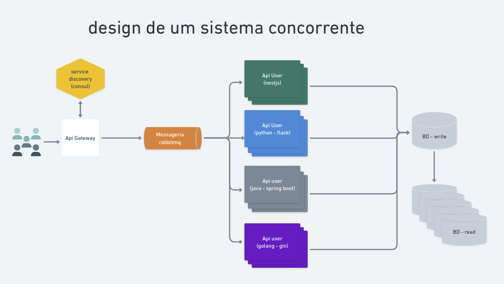

# API REST para gestão de pessoas pensando em alta disponibilidade (HA)

***Arquivo JSON***

    "firstName":"Name",
    "lastName":"lastname",
    "birthdate":"06-10-2002",
    "endereco":"NEW YORK",
    "cargo":"Administração",
    "phones":[
        {
            "DDD":"081",
            "numero":"991426794",
            "type":"HOME"
        }
    ]

## ENDPOINT's

- [POST](https://person-api-projecto.herokuapp.com/api/v1/Person)
- [GET ALL](https://person-api-projecto.herokuapp.com/api/v1/Person)
- [GET ONE](https://person-api-projecto.herokuapp.com/api/v1/Person/1)
- [PUT](https://person-api-projecto.herokuapp.com/api/v1/Person/1)
- [DELETE](https://person-api-projecto.herokuapp.com/api/v1/Person/1)

## diagrama da arquitetura

