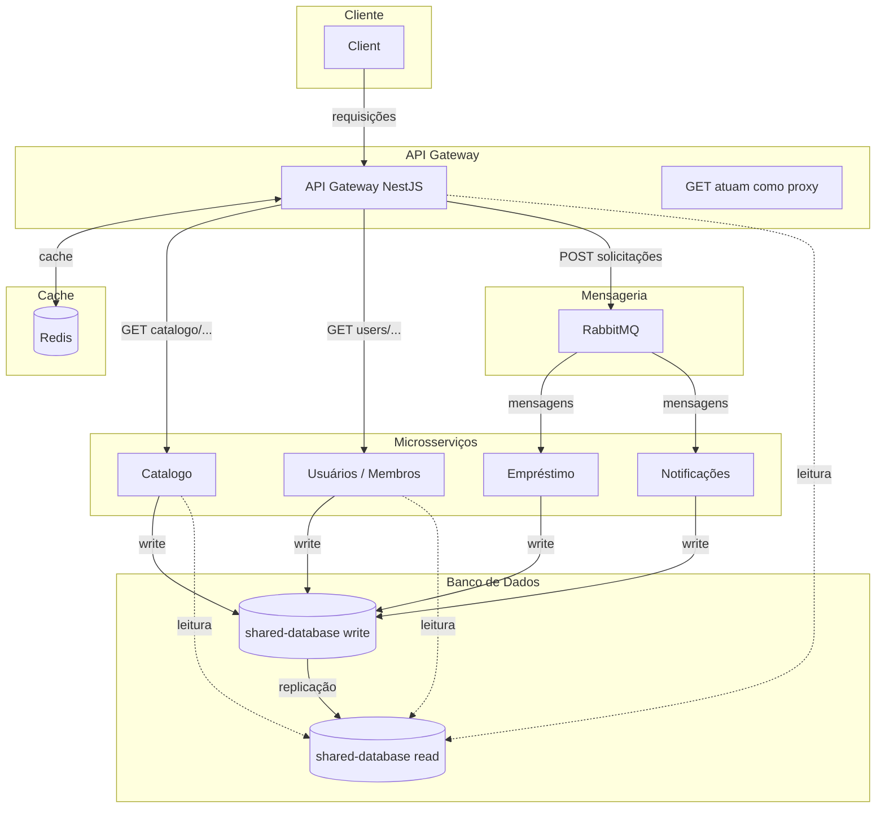

```mermaid
%% Arquitetura Livraria Digital - Microsserviços
%% Diagrama gerado a partir do diagrama de arquitetura do projeto

flowchart TB
    subgraph client [Cliente]
        Client[Client]
    end

    subgraph gateway [API Gateway]
        APIGateway[API Gateway NestJS]
        Note1[GET atuam como proxy]
    end

    subgraph cache [Cache]
        Redis[(Redis)]
    end

    subgraph messaging [Mensageria]
        RabbitMQ[RabbitMQ]
    end

    subgraph microservices [Microsserviços]
        Catalogo[Catalogo]
        Users[Usuários / Membros]
        Emprestimo[Empréstimo]
        Notifications[Notificações]
    end

    subgraph database [Banco de Dados]
        DBWrite[(shared-database write)]
        DBRead[(shared-database read)]
    end

    Client -->|requisições| APIGateway
    APIGateway <-->|cache| Redis
    APIGateway -->|"GET catalogo/..."| Catalogo
    APIGateway -->|"GET users/..."| Users
    APIGateway -->|"POST solicitações"| RabbitMQ
    RabbitMQ -->|mensagens| Emprestimo
    RabbitMQ -->|mensagens| Notifications

    Catalogo -->|write| DBWrite
    Users -->|write| DBWrite
    Emprestimo -->|write| DBWrite
    Notifications -->|write| DBWrite

    DBWrite -->|replicação| DBRead
    APIGateway -.->|"leitura"| DBRead
    Catalogo -.->|"leitura"| DBRead
    Users -.->|"leitura"| DBRead
```